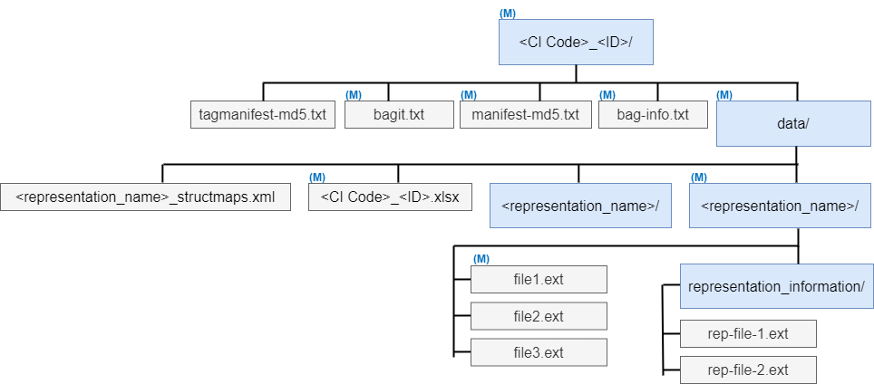

# DRF Common SIP Specification

*\<\<Cluster DRF Project\>\>*

| Document Control       |            |
|------------------------|------------|
| Specification Version: | 0.6        |
| Date:                  | 2024-10-01 |
| Status:                | Final      |

## About this specification

This specification was developed as part of the Cluster DRF project, funded by the NSW Government [Digital Restart Fund](https://www.digital.nsw.gov.au/funding/digital-restart-fund). The Cluster DRF project is a collobarative project which includes the [State Library of NSW](https://www.sl.nsw.gov.au), [Australian Museum](https://australian.museum), [Sydney Opera House](https://www.sydneyoperahouse.com/) and [Art Gallery of New South Wales](https://www.artgallery.nsw.gov.au/).

The purpose of this is to provide a system agnostic Digital Preservation Submission Information Package(SIP) specification which meets the requirements of all four Cultural Institutions (CIs) in the DRF project. This specification has been made public as of version 0.5 under the [MIT license](LICENSE).

A [supplementary document](supplement.md) is also provided which includes some background information and rationale behind decisions made in the specification. This is necessary to keep the main specification document succinct.

## Specification

### Overview

Common SIPs are packaged as BagIt version 0.97 <https://datatracker.ietf.org/doc/html/draft-kunze-bagit-07> with the payload divided into metadata files and representation directories. Each representation directory itself includes the files and directories being preserved and an optional representation_information directory containing representation information. The directory name representation_information is reserved for OAIS representation information.

This specification uses BagIt version 0.97.

### Validation, allowed values and recommended formats

Anything marked with a uppercase **(M)** in parentheses is mandatory. Anything marked with a lowercase **[m]** in square brackets is only mandatory under certain circumstances, typically when other metadata is provided.

Everything else is optional. In spreadsheets with optional columns, if some of the rows have data in that column and others don't you can just leave the cells without data empty. If none of the rows have data for the optional column you can omit that column entirely.

Sheets and columns are generally not repeatable. For repeatability of metadata provided in rows refer to the standard if one exists, otherwise they are generally repeatable.

Refer to standards (Dublin Core, PREMIS, etc) for allowed values and formats. In some cases when using fields from a standard we try and provide guidance by linking to controlled vocabularies but in general refer to the standard for supported values. For fields not part of an existing standard or where this specification further resticts, allowed values or a regular expression may be specified surrounded by single quotes **' '**. PCRE is used for regular expressions. 
Placeholders are surrounded by chevrons **<>**, literal values around placeholders are written without any special formatting.

Always use UTF-8 for character encoding in the tag files and with any data in the xlsx files. This encoding restriction does not apply to text files in representation directories being preserved which can be in any encoding.

We recommend that dates and times are recorded in accordance with ISO 8601 <https://en.wikipedia.org/wiki/ISO_8601> Where time is known we recommend using UTC time. For example:

-   Date: 2024-05-06
-   Time: 23:27:29Z
-   Date and time: 2024-05-06T23:27:29Z

Note that if your source time or date and time is in your local time or some other time zone you will need to convert it to UTC if using this recommended format. Alternatively, you can supply the offset, for example the above in AEST (UTC+10):

-   Time: 09:27:29+10:00
-   Date and time: 2024-05-07T09:27:29+10:00

### CI Code

A code used to identify your cultural institution.

### SIP Directory Name (M)

Top level bag directories to be named in the general form: **\<CI Code\>_\<ID\>**.

**\<ID\>** is a unique identifier which must uniquely identify the SIP for your institution and comply with the pattern **\'^\[a-zA-Z0-9._-\]{1,50}\$'**

We recommend generating a Universally Unique Identifier (UUID) in hexadecimal 8-4-4-4-12 format <https://en.wikipedia.org/wiki/Universally_unique_identifier> This guarantees universal uniqueness for your SIP ID. Tools exist in most operating systems to generate these:

-   Windows (windows names these GUIDs): <https://learn.microsoft.com/en-us/powershell/module/microsoft.powershell.utility/new-guid?view=powershell-7.4>
-   Linux: <https://man7.org/linux/man-pages/man1/uuidgen.1.html>

One example of a UUID is: 52f0fd59-c65c-482b-ba63-9b34e1a3c8c7

Although not strictly necessary it is recommended to use version 4 of UUID if possible.

Another common option is to use a catalogue record identifier. If you use multiple identifier types, please ensure they do not overlap so every bag you create has a unique identifier. Underscores are allowed within the identifier, the first underscore in the directory name is the delimiter between CI code and identifier.

### BagIt Files (M)

- **(M)** data/ -- the payload
- **(M)** bagit.txt -- Contains BagIt version and tag file character encoding.
- **(M)** manifest-md5.txt -- Manifest payload files with md5 checksums.
- tagmanifest-md5.txt -- Manifest of tag files with md5 checksums.
- **(M)** bag-info.txt -- Metadata, for DRF we will be using these fields:
  - Source-Organization -- use your agency acronym
  - Contact-Name -- use your full name.
  - Bagging-Date -- bagging software should generate this.
  - Bag-Size -- bagging software should generate this.
  - **(M)** Payload-Oxum -- bagging software should generate this.
  - Version -- common SIP spec version, if not provided the latest version is assumed.

The MD5 values contained in the bag manifest should be carried all the way through to ingestion in the digital preservation system and should be used by the digital preservation system to verify fixity of files at the completion of ingest.

Any additional fields in bag-info.txt should be ignored except for the purpose of contributing to the overall file hash value during checksum validation when bag-info.txt is listed in tagmanifest-md5.txt as part of a standard bag validation process.

This specification does not support BagIt fetch files or any additional tag files not specified in this section. If any other tag files are provided, they should be ignored unless listed in tagmanifest-md5.txt in which they should be checksum verified as part of a standard bag validation process but otherwise ignored. Any directories aside from the data directory and its descendant directories should be ignored.

This specification does not support groups of bags using Bag-Group-Identifier or any other mechanism.

### Metadata (M)

A single metadata spreadsheet directly in the data directory named using the same convention as the top-level directory **\<CI Code\>_\<ID\>.xlsx** which can include the following sheets:

- Descriptive_additional_schemas
- Descriptive_IE **(M)**
- Descriptive_Reps
- Descriptive_Files
- Administrative_IE
- Administrative_Reps
- PREMIS_Agents
- PREMIS_IE_external_identifiers
- PREMIS_IE_events
- PREMIS_IE_significant_props
- PREMIS_IE_rights
- PREMIS_Rep_events
- PREMIS_Rep_significant_props
- PREMIS_Rep_rights
- PREMIS_Files_events
- PREMIS_Files_significant_props
- PREMIS_Files_creating_app
- PREMIS_Files_inhibitors
- PREMIS_Files_original_name
- PREMIS_Files_rights
- File_Sequence

**Supported descriptive metadata schemas**

The following descriptive metadata schemas are supported by default.

|**Namespace prefix**|**Namespace URI**|**XML XSD**|
|--------------------|-----------------|----------|
|dcterms| <http://purl.org/dc/terms/> |<https://www.dublincore.org/schemas/xmls/qdc/dcterms.xsd>|
|dwc| <http://rs.tdwg.org/dwc/terms/> |<https://dwc.tdwg.org/xml/tdwg_dwc_simple.xsd>|

To use these in the Descriptive sheets prefix the field with namespace prefix and colon. For example:

-   dcterms:title
-   dcterms:identifier
-   dwc:scientificName

See here for the latest Dublin core metadata terms documentation: <https://www.dublincore.org/specifications/dublin-core/dcmi-terms/>

#### Descriptive_additional_schemas

The schema sheet defines additional schemas for descriptive metadata and has three columns:

-   namespace_prefix **\[m\]**
-   namespace_uri
-   xml_xsd

Any namespace prefixes defined here can then be used in the Descriptive sheets in addition to dcterms and dwc.

#### Descriptive_IE **(M)**

A sheet to define IE level descriptive metadata with three columns:

-   md_field **(M)**
-   md_value **(M)**
-   md_encoding

The md_field can include the namespace prefix from a supported schema followed by a colon (:) and then the field name. The field name must be defined in the relevant schema.

The md_encoding field is optional, its purpose is to support additional encoding information about the md_value provided, for example a Dublin Core metadata terms encoding scheme. This can include controlled vocabularies.

The IE sheet must at a minimum include at least one of:

-   dcterms:identifier **(M)**
    -   Three formats are acceptable:
        -   **urn:\<NAMESPACE IDENTIFIER\>:\<NAMESPACE SPECIFIC STRING\>**
            -   URN stands for Uniform Resource Name, see glossary.
            -   Only use registered namespaces <https://www.iana.org/assignments/urn-namespaces/urn-namespaces.xhtml>
        -   **\<NAMESPACE IDENTIFIER\>:\<NAMESPACE SPECIFIC STRING\>**
            -   Instead of using an unregistered URN namespace, use this format without the URN prefix for identifiers using unregistered namespaces.
        -   A URL (Uniform Resource Locator)
    -   Some examples:
        -   https://collection.sl.nsw.gov.au/record/74VK2qGA4MGA
        -   urn:isbn:0451450523
        -   alma_mms_id:991007066609702626
        -   alma_barcode:2758396
        -   axiell_object_number:9663973
        -   vernon_sid:108
        -   ungerboeck_event:502
        -   emu_rec_id:88
    -   It is recommended that you include the unique identifier used in the top-level bag directory name with the namespace identifier common_sip_id, for example:
        -   common_sip_id:52f0fd59-c65cdat-482b-ba63-9b34e1a3c8c7
    -   If available, it is recommended that you provide an identifier for your catalogue or event system here as well as in the PREMIS IE_external_identifers sheet as described below.
-   dcterms:title **(M)**

If you have the information available, the IE sheet should include:

-   dcterms:type - <https://www.dublincore.org/specifications/dublin-core/dcmi-terms/#http://purl.org/dc/terms/type>[,](https://www.dublincore.org/specifications/dublin-core/usageguide/elements/#type,) see here for suggested controlled vocabulary [https://www.dublincore.org/specifications/dublin-core/dcmi-terms/\#section-7\
    ](https://www.dublincore.org/specifications/dublin-core/dcmi-terms/#section-7)This could be used to indicate the aggregation level of the IE, for example collection, series, fonds, item etc.
-   dcterms:date or even better one of the dcterms:date refinements:
    -   <https://www.dublincore.org/specifications/dublin-core/dcmi-terms/#http://purl.org/dc/terms/created>
    -   <https://www.dublincore.org/specifications/dublin-core/dcmi-terms/#http://purl.org/dc/terms/valid>
    -   <https://www.dublincore.org/specifications/dublin-core/dcmi-terms/#http://purl.org/dc/terms/available>
    -   <https://www.dublincore.org/specifications/dublin-core/dcmi-terms/#http://purl.org/dc/terms/issued>
    -   <https://www.dublincore.org/specifications/dublin-core/dcmi-terms/#http://purl.org/dc/terms/modified>
    -   <https://www.dublincore.org/specifications/dublin-core/dcmi-terms/#http://purl.org/dc/terms/dateAccepted>
    -   <https://www.dublincore.org/specifications/dublin-core/dcmi-terms/#http://purl.org/dc/terms/dateCopyrighted>
    -   <https://www.dublincore.org/specifications/dublin-core/dcmi-terms/#http://purl.org/dc/terms/dateSubmitted>
-   dcterms:creator <https://www.dublincore.org/specifications/dublin-core/dcmi-terms/#http://purl.org/dc/terms/creator>
-   dcterms:accessRights <https://www.dublincore.org/specifications/dublin-core/dcmi-terms/#http://purl.org/dc/terms/accessRights>
    -   This is purely descriptive and will generally not be used by systems to enforce access controls.

#### Descriptive_Reps

A sheet to define representation specific descriptive metadata with four columns:

-   rep_path **\[m\]**
-   md_field **\[m\]**
-   md_value **\[m\]**
-   md_encoding

The rep_path value must be the name of the **\<representation_name\>** on disk. See above for explanation of the md_field, md_value and md_encoding columns.

#### Descriptive_Files

A sheet to define file specific descriptive metadata with these columns:

-   file_path **\[m\]**
-   md_field **\[m\]**
-   md_value **\[m\]**
-   md_encoding

The file_path value must be the full path to the file on disk relative to the data directory. See above for explanation of the md_field, md_value and md_encoding columns.

#### Administrative_IE

The following fields are supported in this sheet:

-   md_field **\[m\]**
-   md_value **\[m\]**

md_field must be from the following controlled vocabulary:

-   **'destination_path'**
    -   The path where the AIP should be stored. Provided as a file system path with forward slash as the separator.
    -   For example, a valid path is: /digitised/manuscripts/banks/voyage_collection/series_1/
    -   The level of support and implementation details are DP system specific and outside the scope of this specification.
    -   If not provided the DP system will need to decide where to store the AIP, it could be a default location or perhaps based on date of ingest. These details are DP system specific and outside the scope of this specification.
-   **'producer'**
    -   If you want to indicate this SIP is from a producer (See OAIS reference model) different to your organisation name.
    -   If not provided, assumed to be your organisation name.
-   **'division'**
    -   Assign the IE to a particular division/department/branch within your organisation. For example, *"Digitisation & Imaging"*
-   **'ingest_processing_group'**
    -   Used to group SIPs into shared processing configurations. For example, you may have a group called *av_recorded_performances* and assigning IEs to this group indicates they will all need similar processing during ingestion.
    -   If and how this is used is DP system specific and outside the scope of this specification.
-   **'retention_review_date'**
    -   A date in ISO 8601 format **YYYY-MM-DD** for when the retention of the IE in the DP system should be flagged for review. If not specified there is no retention policy applied.
-   **'collection'**
    -   A literal value to indicate that this IE belongs to a particular collection. Specify the same value for multiple SIPs to group IEs together.
    -   If and how this is used is DP system specific and outside the scope of this specification.

#### Administrative_Reps

A sheet to define representation specific administrative metadata with three columns:

-   rep_path **\[m\]**
-   md_field **\[m\]**
-   md_value **\[m\]**

The rep_path value must be the name of the **\<representation_name\>** directory on disk.

md_field must be from the following controlled vocabulary:

-   **'bitstream_preservation_level'**
    -   Values allowed are **'low'**, **'medium'** and **'high'**. This should be used for two purposes:
        -   Recording in PREMIS preservationLevel
        -   As an indication of how many copies are needed, the level of copy independence required and the level of integrity checking required. In general, there is no guarantee that a specific number of copies will be achievable or that full technological, organisational and geographical independence will be achieved. These decisions have major cost implications which need to be considered by project teams. These decisions are outside the scope of this specification.
    -   If not provided, defaults to **'high'**.
    -   In general, the higher the level the higher the cost.
-   **'cold_storage_only'**
    -   Values allowed are **'true'** and **'false'**, if not provided defaults to **'false'**. If **'true'**, the contents of this representation should be preserved in cold storage only. This has implications including:
        -   Defrost needed before any recharacterisation or preservation actions are performed on files. These defrost operations may incur a cost and will take time.
        -   Defrost of the entire repository will be needed for exit strategy, this may delay exit or migration to another system and may incur a significant cost.
        -   Possible impacts to the viability, speed and cost of rolling integrity checking.
    -   Although cold storage is generally significantly cheaper than hot storage, access costs are generally more expensive and integrity checking may be more expensive and slower.

**PREMIS Metadata**

Based on PREMIS 3.0 <https://www.loc.gov/standards/premis/v3/premis-3-0-final.pdf> PREMIS has a concept of containers *\"In some cases a semantic unit takes the form of a container that groups a set of related semantic units."* This concept is difficult to replicate directly in spreadsheets. To eliminate any ambiguity the PREMIS semantic unit number and hierarchy has been provided for each field. A consequence of this container concept and its translation to spreadsheet form is that some fields marked as optional in this common SIP specification make no sense without other fields to provide context, these cases are mostly obvious but refer to the PREMIS data dictionary if there is any doubt.

#### PREMIS_Agents

*"The Agent entity aggregates information about attributes or characteristics of Agents (persons, organizations, or software) associated with Rights management and preservation events in the life of a data object." <https://www.loc.gov/standards/premis/v3/premis-3-0-final.pdf>*

A sheet to define PREMIS agents which are referenced in events with the following columns:

-   agent_identifier_type **\[m\]**
    -   Semantic unit 3.1.1 agentIdentifier=\>agentIdentifierType
-   agent_identifier_value **\[m\]**
    -   Semantic unit 3.1.2 agentIdentifier=\>agentIdentifierValue
    -   Must uniquely identifier a single agent in your repository. Note that this means should you wish to represent multiple versions of the same agent, the value here should include the version.
-   agent_name
    -   Semantic unit 3.2 agentName
-   agent_type
    -   Semantic unit 3.3 agentType
-   agent_version
    -   Semantic unit 3.4 agentVersion

#### PREMIS_IE_external_identifiers

A sheet to record URLs which link to the external description of the IE, typically a catalogue record. These should be added as secondary objectIdentifiers on the IE in addition to the primary unique identifier generated by the digital preservation system. The sheet supports a single column:
-   URL

See the example in PREMIS data dictionary on pages 10/11 and the supplement document for more information.

#### PREMIS_IE_events

A sheet to record PREMIS provenance and pre-ingest preservation events related to the entire IE with the following columns:

-   event_type **\[m\]**
    -   Semantic unit 2.2 eventType
    -   Taken from controlled vocabulary [**https://id.loc.gov/vocabulary/preservation/eventType.html**](https://id.loc.gov/vocabulary/preservation/eventType.html)
-   event_date_time **\[m\]**
    -   Semantic unit 2.3 eventDateTime
-   event_detail
    -   Semantic unit 2.4.1 eventDetailInformation=\>eventDetail
    -   Additional information about the event
-   event_outcome
    -   Semantic unit 2.5.1 eventOutcomeInformation=\>eventOutcome
    -   A categorization of the overall result of the Event in terms of success, partial success, or failure.
-   linking_agent_identifier_value
    -   Semantic unit 2.6.2 linkingAgentIdentifier=\>linkingAgentIdentifierValue
    -   **Must use a value from the PREMIS_Agents sheet**
-   linking_agent_role
    -   Semantic unit 2.6.3 linkingAgentIdentifier=\>linkingAgentRole
    -   The role of the Agent in relation to this event
    -   This value makes no sense without the linking_agent_identifier_value above
    -   Value from controlled vocabulary [**https://id.loc.gov/vocabulary/preservation/eventRelatedAgentRole.html**](https://id.loc.gov/vocabulary/preservation/eventRelatedAgentRole.html)

#### PREMIS_IE_significant_props

According to PREMIS significant properties are *"Characteristics of a particular object subjectively determined to be important to maintain through preservation actions." <https://www.loc.gov/standards/premis/v3/premis-3-0-final.pdf>*

A sheet to record the significant properties of the IE as a whole with the following columns:

-   significant_properties_type
    -   Semantic unit 1.4.1 significantProperties=\>significantPropertiesType
-   significant_properties_value
    -   Semantic unit 1.4.2 significantProperties=\>significantPropertiesValue

#### PREMIS_IE_rights

According to PREMIS *"The minimum core Rights information that a preservation repository must know, however, is what Rights or permissions a repository has to carry out actions related to objects within the repository. These may generally be granted by copyright law, by statute, or by a license agreement with the rightsholder." <https://www.loc.gov/standards/premis/v3/premis-3-0-final.pdf>*

*"The PREMIS rightsStatement is intended to allow a preservation repository to determine whether it has the right to perform a certain action in an automated fashion, with some documentation of the basis for the assertion" <https://www.loc.gov/standards/premis/v3/premis-3-0-final.pdf>*

Although PREMIS rights are designed to be enforceable by the system in practice this isn't widely supported. In most implementations these PREMIS rights will be used by digital preservation staff from a CI to help them decided what actions are allowed.

A sheet to record the rights as they apply to the IE overall with the following columns:

-   rights_basis **\[m\]**
    -   Semantic unit 4.1.2 rightsStatement=\>rightsBasis
    -   Taken from controlled vocabulary [**https://id.loc.gov/vocabulary/preservation/rightsBasis.html**](https://id.loc.gov/vocabulary/preservation/rightsBasis.html)
    -   Must be one of:
        -   **'copyright'**
        -   **'license'**
        -   **'statute'**
        -   **'other'**
-   act
    -   Semantic unit 4.1.7.1 rightsStatement=\>rightsGranted=\>act
    -   The action the preservation repository is allowed to take
    -   Taken from controlled vocabulary [**https://id.loc.gov/vocabulary/preservation/eventType.html**](https://id.loc.gov/vocabulary/preservation/eventType.html)

-   start_date
    -   Semantic unit 4.1.7.3.1 rightsStatement=\>rightsGranted=\>termOfGrant=\>startDate
    -   The date the granted permission commences.
    -   This value makes no sense without act above
    -   If an end_date is provided (see next) then a start_date is mandatory

-   end_date
    -   Semantic unit 4.1.7.3.2 rightsStatement=\>rightsGranted=\>termOfGrant=\>endDate
    -   The date the granted permission expires.
    -   This value makes no sense without act above

If there are multiple acts with the same basis, repeat the entire row and duplicate rights_basis.

The following additional columns will vary depending on the rights_basis as follows. In this specific section **\[m\]** is only applicable if the rights_basis matches:

***'copyright'***

-   copyright_status **\[m\]**
    -   Semantic unit 4.1.3.1 rightsStatement =\>copyrightInformation=\>copyrightStatus
    -   Taken from controlled vocabulary [**https://id.loc.gov/vocabulary/preservation/copyrightStatus.html**](https://id.loc.gov/vocabulary/preservation/copyrightStatus.html)
-   copyright_jurisdiction **\[m\]**
    -   Semantic unit 4.1.3.2 rightsStatement=\>copyrightInformation=\>copyrightJurisdiction
    -   The country whose copyright laws apply, taken from ISO 3166.
-   copyright_start_date
    -   Semantic unit 4.1.3.6.1 rightsStatement=\>copyrightInformation=\>copyrightApplicableDates=\>startDate
    -   The date the granted copyright commences.
-   copyright_end_date
    -   Semantic unit 4.1.3.6.2 rightsStatement=\>copyrightInformation=\>copyrightApplicableDates=\>endDate
    -   The date the granted copyright expires.

***'license'***

-   license_terms
    -   Semantic unit 4.1.4.2 rightsStatement=\>licenseInformation=\>licenseTerms
    -   Description of the license.
-   license_start_date
    -   Semantic unit 4.1.4.4.1 rightsStatement=\>licenseInformation=\>licenseApplicableDates=\>startDate
    -   The beginning date of the rights granted
-   license_end_date
    -   Semantic unit 4.1.4.4.1 rightsStatement=\>licenseInformation=\>licenseApplicableDates=\>endDate
    -   The ending date of the rights granted

***'statute'***

-   statute_jurisdiction **\[m\]**
    -   Semantic unit 4.1.5.1 rightsStatement=\>statuteInformation=\>statuteJurisdiction
    -   Country or other political body enacting the statute.
    -   Taken from ISO 3166
-   statute_citation **\[m\]**
    -   Semantic unit 4.1.5.2 rightsStatement=\>statuteInformation=\>statuteCitation
    -   An identifying designation for the statute
-   statute_start_date
    -   Semantic unit 4.1.5.6.1 rightsStatement=\>statuteInformation=\>statuteApplicableDates=\>startDate
    -   The date the granted statute commences
-   statute_end_date
    -   Semantic unit 4.1.5.6.2 rightsStatement=\>statuteInformation=\>statuteApplicableDates=\>endDate
    -   The date the granted statute expires

***'other'***

-   other_basis **\[m\]**
    -   Semantic unit 4.1.6.2 rightsStatement=\>otherRightsInformation=\>otherRightsBasis
    -   Any rights basis other than copyright, license or statute
-   other_notes
    -   Semantic unit 4.1.6.4 rightsStatement=\>otherRightsInformation=\>otherRightsNotes
    -   Additional information about the Rights of the object.
-   other_start_date
    -   Semantic unit 4.1.6.3.1 rightsStatement=\>otherRightsInformation=\>otherRightsApplicableDates=\>startDate
    -   The date the granted right commences
-   other_end_date
    -   Semantic unit 4.1.6.3.2 rightsStatement=\>otherRightsInformation=\> otherRightsApplicableDates=\>endDate
    -   The date the granted right expires

#### PREMIS_Rep_events

A sheet to record PREMIS provenance and pre-ingest preservation events for specific representations with the following columns:

-   rep_path **\[m\]**
    -   **\<representation_name\>** on disk
-   second_rep_path
    -   **\<representation_name\>** on disk
-   See above IE_events for other columns also applicable here

A second rep path is for linking two representations through an event, typically this will be used when a derivative representation is created.

#### PREMIS_Rep_significant_props

A sheet to record the significant properties of specific representations with the following columns:

-   rep_path **\[m\]**
    -   **\<representation_name\>** on disk
-   See IE_significant_properties for other columns also applicable here

#### PREMIS_Rep_rights

A sheet to record the rights as they apply to specific representations with the following columns:

-   rep_path **\[m\]**
    -   **\<representation_name\>** on disk
-   See IE_rights for other columns also applicable here

#### PREMIS_Files_events

A sheet to record PREMIS provenance and pre-ingest preservation events for specific files.

-   file_path **\[m\]**
    -   relative path to file on disk from data directory
-   second_file_path
    -   relative path to file on disk from data directory
-   See above IE_events for other columns also applicable here

A second file path is for linking two files through an event, typically this will be used when a derivative file is created.

#### PREMIS_Files_significant_props

A sheet to record the significant properties of specific files with the following columns:

-   file_path **\[m\]**
    -   relative path to file on disk from data directory
-   See IE_significant_properties for other columns also applicable here

PREMIS defines significant properties as *"Characteristics of a particular object **subjectively** determined to be important to maintain through preservation actions."* Significant properties in this sheet should be interpreted following the PREMIS definition, this can include both technical metadata and other significant properties of the file.

#### PREMIS_Files_creating_app

*"Information about the application that created the object." <https://www.loc.gov/standards/premis/v3/premis-3-0-final.pdf>*

A sheet to record the creating application for specific files with the following columns:

-   file_path **\[m\]**
    -   relative path to file on disk from data directory
-   creating_application_name
    -   Semantic unit 1.5.5.1 objectCharacteristics=\>creatingApplication=\>creatingApplicationName
-   creating_application_version
    -   Semantic unit 1.5.5.2 objectCharacteristics=\>creatingApplication=\>creatingApplicationVersion

#### PREMIS_Files_inhibitors

*"Inhibitors are defined as any features of an object intended to inhibit access, use, or migration. Inhibitors include password protection and encryption. It is difficult to describe inhibitors by program, because the program may be prevented from analyzing the object, so if you know a file has inhibitors, it is important to note this. PREMIS defines semantic units for inhibitor type, target (the actions that are inhibited), and key (password or other mechanism to bypass the inhibitor)." <https://www.loc.gov/standards/premis/understanding-premis.pdf>*

A sheet to record the inhibitors for specific files with the following columns:

-   file_path **\[m\]**
    -   relative path to file on disk from data directory
-   inhibitor_type **\[m\]**
    -   Semantic unit 1.5.6.1 objectCharacteristics=\>inhibitors=\>inhibitorType
    -   Taken from controlled vocabulary [**https://id.loc.gov/vocabulary/preservation/inhibitorType.html**](https://id.loc.gov/vocabulary/preservation/inhibitorType.html)
-   inhibitor_target
    -   Semantic unit 1.5.6.2 objectCharacteristics=\>inhibitors=\>inhibitorTarget
    -   Taken from controlled vocabulary [**https://id.loc.gov/vocabulary/preservation/eventType.html**](https://id.loc.gov/vocabulary/preservation/eventType.html)
    -   This value only makes sense if inhibitor_type is provided
-   inhibitor_key
    -   Semantic unit 1.5.6.3 objectCharacteristics=\>inhibitors=\>inhibitorKey
    -   **Do not use an actual key or password!** Instead provide a description of where the key or password can be found by an authorised user.
    -   This value only makes sense if inhibitor_type is provided

#### PREMIS_Files_original_name

A sheet to record the original names for specific files with the following columns:

-   file_path **\[m\]**
    -   relative path to file on disk from data directory
-   original_name **\[m\]**
    -   Semantic unit 1.6 originalName
    -   original filename if different to that on disk. This can be a path or a filename. If a path it must be the full path relative from the data directory which means it starts with **\<representation_name\>/**. This should be stored in PREMIS originalName for provenance and may also be useful in the future for reproducing the original directory and filenames.
    -   Cannot include parent directory symbol \'../\'
    -   Using UTF-8 encoding in the XLSX file is very important here as the characters in UTF-8 encoding are what you are indicating you want preserved. This should be interpreted as UTF-8 so if you use a different encoding the characters may differ!

#### PREMIS_Files_rights

A sheet to record the rights as they apply to specific files with the following columns:

-   file_path **\[m\]**
    -   relative path to file on disk from data directory
-   See IE_rights for other columns also applicable here

#### File_Sequence

If you wish to provide a specific ordering of files within representations which differs from the file system ordering.

-   file_path **\[m\]**
    -   relative path to file on disk from data directory
-   index **\[m\]**
    -   integer representing order
-   label
    -   May be used as the label to a structural map or label within other supported structure within the DP system

### Representation structural map XML

An XML file data/**\<representation_name\>_structmaps.xml** can be provided for each representation. A METS file with structMap sections <http://www.loc.gov/standards/mets/METSOverview.v2.html#structmap>

These are useful in cases where a more complicated arrangement or grouping of files is important and need to be recorded in the preservation system. This will generally be used for logical structural maps, for example to defining chapters within a book and the pages within each chapter. Use relative path to file on disk from the relevant **\<representation_name\>/** directory for the FILEID values.

### Representation directories

**(M)** At least one **\<representation_name\>/** directory is required with at least one file. It is recommended that **\<representation_name\>** itself should be limited to the standard characters as defined in *File and directory naming* in the [supplementary document](supplement.md)

The data/**\<representation_name\>/** directories contains the files for preservation. In the above diagram, the files are in a flat directory structure however this specification does allow nested directories\*.

How this directory name will be used depends on the specific digital preservation system, it may just be a directory name to group the files together or it may be stored in metadata. PREMIS itself does not provide any field for the representation name/type. It is recommended to be consistent with your naming of these representation directories and where possible reuse a common set of directory names to facilitate in reporting and preservation planning. Of course, there will be edge cases where individual IEs have unique representation names not shared with other IEs and this is fine.

In cases where the original directory structure and or filenames are important for preservation, provenance and/or rendering you have three options with this SIP specification:

**Option one**

Change nothing, store and name the files within the **\<representation_name\>/** directory as you want them preserved.

**Option two**

Standardise file/directory names and/or flatten directory hierarchy on disk and provide original_name metadata in the metadata spreadsheet under PREMIS_Files_original_name to include the original directory structure and/or filename. It is also best to record the renaming in the SIP as a PREMIS event. This original_name metadata may be used at some point in the future to rename the file back to its original name, if/when/how that occurs is outside the scope of this document but recording the original name here gives you the option.

This specification doesn't impose any restrictions on directory and file naming within the representation directories so option one is always allowed even with non-standard characters. Option two may be considered when you have directories or files with problematic characters to ensure they are maintained as SIPs are processed and moved between file systems. If considering option two see *File and directory naming* in the [supplementary document](supplement.md) for more details and some suggestions. In general, it is not advisable to rename files or directories unless necessary.

**Option three**

Use an archive file or disk image, there is nothing in this specification which prohibits this, but it is a complicated topic with pros and cons and is outside the scope of this document.

*\*The representation_information directory name is reserved.*

### Representation information

The data/**\<representation_name\>**/representation_information/ directory is a reserved optional directory for any OAIS representation information which isn't generated by the preservation system during ingestion or supported in other parts of this specification. This can be anything which assists the designated community of the repository in rendering or understanding the files being preserved.

Environment objects and representation information networks are not supported by this specification. Further analysis and manual preparation will need to be conducted for these more complex examples of representation information.

It is recommended that filenames within this directory be restricted to standard characters as defined in *File and directory naming* in the [supplementary document](supplement.md) unless maintaining these filenames is important for preservation or provenance. Note that there is no support in this specification for recording the original names of files within representation_information.

## References
Anderson, R. (2013). The Moab Design for Digital Object Versioning. The Code4Lib Journal, 21. https://journal.code4lib.org/articles/8482

Audit and certification—Digital Preservation Handbook. (n.d.). Retrieved September 5, 2024, from https://www.dpconline.org/handbook/institutional-strategies/audit-and-certification

BagIt Profiles Specification 1.4.0. (n.d.). Retrieved September 5, 2024, from https://bagit-profiles.github.io/bagit-profiles-specification/

Boyko, A., Kunze, J. A., Littman, J., Madden, L., & Vargas, B. (2012). The BagIt File Packaging Format (V0.97) (Internet Draft No. draft-kunze-bagit-07). Internet Engineering Task Force. https://datatracker.ietf.org/doc/draft-kunze-bagit-07

Common Specification for Information Packages. (n.d.). Retrieved September 5, 2024, from https://dilcis.eu/specifications/common-specification

Congress, T. L. of. (n.d.). Preservation Schemes (all) - LC Linked Data Service: Authorities and Vocabularies | Library of Congress, from LC Linked Data Service: Authorities and Vocabularies (Library of Congress) [Webpage]. Retrieved September 5, 2024, from https://id.loc.gov/vocabulary/preservation.html

Consultative Committee for Space Data Systems. (2012). CCSDS 661.0-B-1: Cross Support Data Management – Service and Protocols (CCSDS 661.0-B-1). https://public.ccsds.org/Pubs/661x0b1.pdf

Consultative Committee for Space Data Systems. (2021). CCSDS 651.0-G-1: Space Link Extension (SLE) – Service and Protocols (CCSDS 651.0-G-1). https://public.ccsds.org/Pubs/651x2g1.pdf

Core terms defined by Darwin Core. (n.d.). Retrieved September 5, 2024, from http://rs.tdwg.org/dwc/terms.htm

DCMI Metadata Terms. (n.d.). DCMI. Retrieved September 5, 2024, from https://www.dublincore.org/specifications/dublin-core/dcmi-terms/

Darwin Core. (n.d.). Retrieved September 5, 2024, from https://dwc.tdwg.org/

Digital Content Transfer Tools—Digital Preservation (Library of Congress). (n.d.). Retrieved September 5, 2024, from https://www.digitalpreservation.gov/series/challenge/data-transfer-tools.html

E-ARK SIP | Specification for Submission Information Packages. (n.d.). Retrieved September 5, 2024, from https://earksip.dilcis.eu/

Filename. (2024). In Wikipedia. https://en.wikipedia.org/w/index.php?title=Filename&oldid=1241300520

ISO 8601. (2024). In Wikipedia. https://en.wikipedia.org/w/index.php?title=ISO_8601&oldid=1243637756

Langley, S. (2018). Digital Preservation Should Be More Holistic: A Digital Stewardship Approach. American Library Association. https://doi.org/10.17863/CAM.34317

Library of Congress. (2017). PREMIS data dictionary for preservation metadata, version 3.0. Retrieved September 5, 2024, from https://www.loc.gov/standards/premis/v3/premis-3-0-final.pdf

Library of Congress. (2017). Understanding PREMIS (Version 3.0). Retrieved September 5, 2024, from https://www.loc.gov/standards/premis/understanding-premis.pdf

LibraryOfCongress/bagger. (2024). [Java]. Library of Congress. https://github.com/LibraryOfCongress/bagger (Original work published 2014)

LibraryOfCongress/bagit-python. (2024). [Python]. Library of Congress. https://github.com/LibraryOfCongress/bagit-python (Original work published 2013)

METS: An Overview & Tutorial: Metadata Encoding and Transmission Standard (METS) OfficialWeb Site. (n.d.). Retrieved September 5, 2024, from https://www.loc.gov/standards/mets/METSOverview.v2.html#structmap

Metadata Encoding and Transmission Standard (METS) Official Web Site | Library of Congress. (n.d.). Retrieved September 5, 2024, from https://www.loc.gov/standards/mets/

OCFL Specifications. (n.d.). Oxford Common File Layout. Retrieved September 5, 2024, from https://ocfl.io/

OCLC, & Lavoie, B. (2014). The Open Archival Information System (OAIS) Reference Model: Introductory Guide (2nd Edition) (Second). Digital Preservation Coalition. https://doi.org/10.7207/twr14-02

PREMIS: Preservation Metadata Maintenance Activity (Library of Congress). (n.d.). Retrieved September 5, 2024, from https://www.loc.gov/standards/premis/

Parchive. (2024). In Wikipedia. https://en.wikipedia.org/w/index.php?title=Parchive&oldid=1237832538

Preserving the Scholarly and Cultural Record. (n.d.). APTrust. Retrieved September 5, 2024, from https://aptrust.org/

Producer-Archive Interface Specification (PAIS)—A Tutorial. (2016).

Reference Model for an Open Archival Information System (OAIS). (2012).

UTF-8. (2024). In Wikipedia. https://en.wikipedia.org/w/index.php?title=UTF-8&oldid=1243882536

Uniform Resource Name. (2024). In Wikipedia. https://en.wikipedia.org/w/index.php?title=Uniform_Resource_Name&oldid=1220954593

Uniform Resource Names (URN) Namespaces. (n.d.). Retrieved September 5, 2024, from https://www.iana.org/assignments/urn-namespaces/urn-namespaces.xhtml

Universally unique identifier. (2024). In Wikipedia. https://en.wikipedia.org/w/index.php?title=Universally_unique_identifier&oldid=1243853686

XLSX Transitional (Office Open XML), ISO 29500:2008-2016, ECMA-376, Editions 1-5. (2024, May 9). [Web page]. https://www.loc.gov/preservation/digital/formats/fdd/fdd000398.shtml

XML Schema (W3C). (2024). In Wikipedia. https://en.wikipedia.org/w/index.php?title=XML_Schema_(W3C)&oldid=1244107261

sdwheeler. (n.d.). New-Guid (Microsoft.PowerShell.Utility)—PowerShell. Retrieved September 5, 2024, from https://learn.microsoft.com/en-us/powershell/module/microsoft.powershell.utility/new-guid?view=powershell-7.4

uuidgen(1)—Linux manual page. (n.d.). Retrieved September 5, 2024, from https://man7.org/linux/man-pages/man1/uuidgen.1.html

## Glossary

**Bag**: The packages created by BagIt (refer to BagIt).

**BagIt**: A hierarchical file packaging format for storage and transfer of digital content.

**Bitstream preservation**: Ensuring that data does not change, that all bits remain fixed.

**Content preservation:** Preserving the meaning of the files and ability to render the files. In OAIS terms ensuring that the designated community of the repository can render and understand the content data object with the help of representation information.

**Dublin Core:** A descriptive metadata standard.

**Darwin Core:** A descriptive metadata standard.

**Environment object:** Technology (software or hardware) supporting a Digital Object in some way (e.g. rendering or execution). Environments can be described as Intellectual Entities and captured and preserved in the preservation repository as Representations, Files and/or Bitstreams.

**OAIS:** Open Archival Information System. A conceptual framework which documents a functional model and an informational model used widely by digital preservation repositories.

**METS:** Metadate Encoding &Transmission Standard. The METS schema is a standard for encoding descriptive, administrative, and structural metadata regarding objects within a digital library, expressed using the XML schema language of the World Wide Web Consortium

**POSIX:** The Portable Operating System Interface is a family of standards specified by the IEEE Computer Society for maintaining compatibility between operating systems.

**PREMIS:** PREservation Metadata: Implementation Strategies (PREMIS) is the de facto digital preservation metadata standard.

**Representation information:** A concept for the OAIS reference model. The information that maps a Data Object into more meaningful concepts.

**Representation network:** A concept for the OAIS reference model. The set of Representation Information that fully describes the meaning of a Data Object. Representation Information in digital forms needs additional Representation Information so its digital forms can be understood over the Long Term.

**SIP:** Submission Information Package is a type of information package defined in the OAIS reference model.

**Structural map:** The structural map is the heart of a METS document. It outlines a hierarchical structure for the digital library object and links the elements of that structure to content files and metadata that pertain to each element.

**URN:** Uniform Resource Name. A type of URI (Uniform Resource Indicator) used to identify but not locate a resource.

**UTF-8:** A variable-length character encoding standard used for electronic communication. Defined by the Unicode Standard.

**UUID:** A UUID (Universal Unique Identifier) is a 128-bit value used to uniquely identify an object or entity on the internet.

**XLSX:** A file with the XLSX file extension is a Microsoft Excel Open XML Format Spreadsheet file.

**XSD:** An XML schema definition (XSD), is a framework document that defines the rules and constraints for XML documents.
